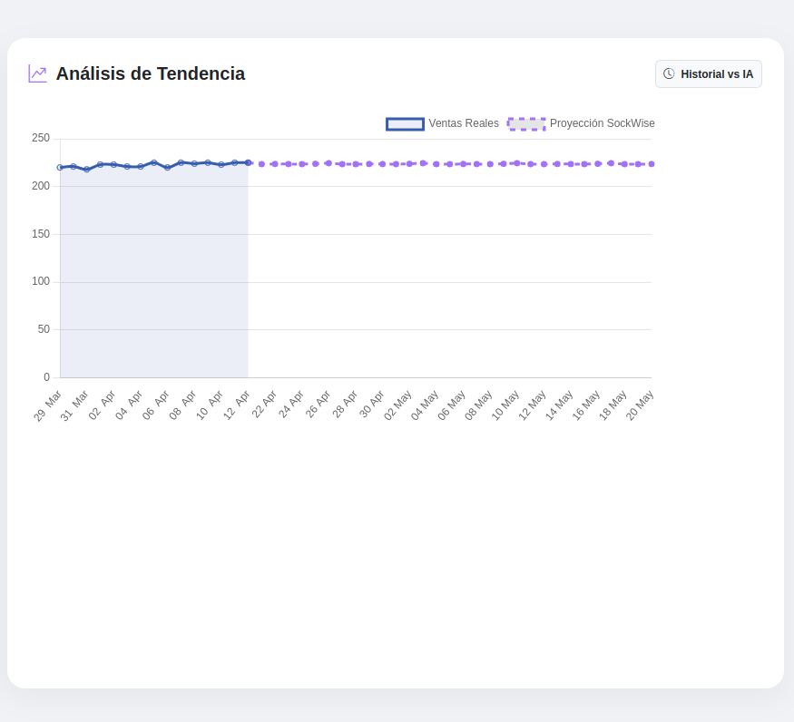
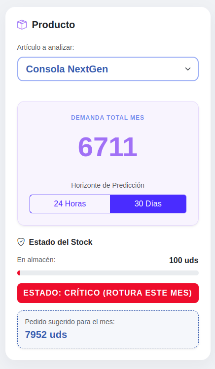

# 📈 StockWise AI - Predicción de Demanda Inteligente


Sistema de análisis predictivo diseñado para optimizar la gestión de inventarios mediante **Machine Learning**. La aplicación analiza patrones históricos de ventas para proyectar la demanda futura y recomendar acciones de compra inteligentes, evitando roturas de stock y exceso de inventairo.

---

## 🚀 Descripción del Proyecto

StockWise AI trasciende la gestión tradicional de almacenes al integrar un cerebro estadístico. El sistema no solo muestra lo que se vendió, sino que utiliza modelos de **Regresión (Random Forest)** para estimar las ventas de los próximos 30 días con alta precisión.

- **Análisis de Patrones:** Identificación automática de tendencias alcistas y estacionalidad (ej. picos de venta en verano).
- **Inferencia Recursiva:** Capacidad de proyectar horizontes temporales de corte (24h) y largo plazo (30 días).
- **Asistente de Compra:** Lógica prescriptiva que calcula el "Stock de Seguridad" y genera sugerencias de pedido automáticas.

---

## ✨ Funcionalidades Clave

✅ **Predicción Dinámica:** Motor de IA que estima la demanda diaria basándose en variables de calendario y memoria histórica (Lags).
✅ **Dashboard Visual:** Gráficas interactivas con **Chart.js** que comparan las ventas reales con las proyecciones de la IA.
✅ **Semáforo de Inventario:** Indicadores visuales de estado (Crítico, Bajo y Óptimo) según la cobertura de stock para el mes entrante.
✅ **Feature Engineering Pro:** Transformación de datos SQL en variables matemáticas (Medias móviles, días de la semana, factores estacionales).
✅ **Arquitectura de API:** Endpoint de inferencia en tiempo real que permite integrar la IA con cualquier otro software empresarial.

---

## 📸 Galería del Sistema

### 🖥️ Dashboard de Inteligencia
Visualización de la tendencia histórica y proyección de demanda acumulada.


### 🤖 Asistente de Compra
Lógica de decisión que recomienda cuántas unidades adquirir para cubrir la demanda estimada.


---

## 🏗️ Arquitectura de Datos (Pipeline de IA)

```text
[ Base de Datos SQL ] ──► [ Feature Engineering ] ──► [ Random Forest Model ]
          │                         │                         │
    (Ventas Reales)          (Lags & Rolling)          (Inferencia .pkl)
          │                         │                         │
          └─────────────────────────┼─────────────────────────┘
                                    ▼
                          [ FastAPI Dashboard ] ──► [ Chart.js Visuals ]
```

## 📂 Estructura del Proyecto

```text
├── app/
│   ├── main.py            # Dashboard, API de predicción y lógica de inventario
│   ├── database.py        # Configuración de SQLite con rutas absolutas
│   ├── models.py          # Modelos de datos (Product y DailySale)
│   ├── ai/                # 🧠 Núcleo de Machine Learning
│   │   ├── feature_engineer.py # Transformación de datos (Lags y Medias móviles)
│   │   ├── trainer.py     # Script de entrenamiento y evaluación del modelo
│   │   ├── predictor.py   # Motor de inferencia y proyecciones de 30 días
│   │   └── model_store/   # Carpeta para el modelo entrenado (.pkl)
│   ├── services/          # Lógica de cálculo de stock y compras sugeridas
│   ├── templates/         # 📄 Vistas HTML (Dashboard dinámico con Jinja2)
│   └── static/            
│       └── css/           # Estilos visuales personalizados (Tech Style)
├── data/                  # Almacenamiento de la base de datos y datasets
├── docs/                  # 📸 Documentación visual
│   └── screenshots/       # Capturas de pantalla (Dashboard, Alertas, IA)
├── generate_data.py       # Script para simular mercado con tendencias reales
├── verify_patterns.py     # Script de análisis estadístico previo a la IA
├── run.sh                 # Script de arranque rápido y activación de entorno
├── requirements.txt       # Dependencias (Scikit-Learn, FastAPI, Pandas...)
├── .gitignore             # Filtro de archivos para el repositorio
└── README.md              # Documentación técnica maestra
```

## 🧪 Ciencia de Datos y Rendimiento

El modelo ha sido entrenado y validado siguiendo estándares profesionales:

- **Algoritmo:** Random Forest Regressor (100 árboles)
- **Métricas obtenidas:** Error Medio Absoluto (MAE) de ~1.5 unidades, garantizando una desviación mínima en la predicción operativa
- **Variables (Features):** Mes, día de la semana, flag de fin de semana, ventas del día anterior (Lag 1) y media móvil semanal (Rolling 7).

## ⚙️ Instalación y Uso
1. **Entorno:** `python -m venv venv` y `source venv/bin/activate`
2. **Dependencias:** `pip install -r requirements.txt`
3. **Generar Datos:** `export PYTHONPATH=$PYTHONPATH:.` y `python generate_data.py`
4. **Entrenar IA:** `python app/ai/trainer.py`
5. **Iniciar Dashboard:** `./run.sh`

## 📓 Notas de Desarrollo
Este proyecto demuestra la capacidad de integrar **Machine Learning** en aplicaciones web funcionales. A diferencia de un modelo estático en un Jupyter Noteboo, StockWise AI es un **producto listo para el usuario final**, enfocado en la optimización de costes y la eficiencia logística.

**build:** versión final 1.0.0 estable